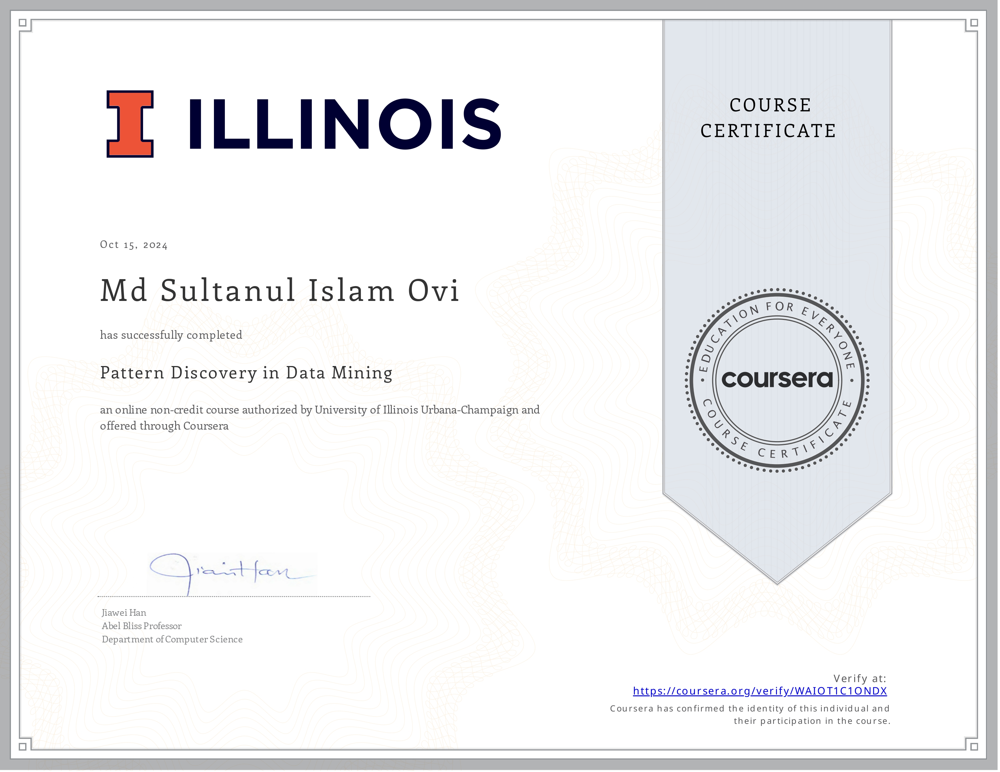

# Data Mining Specialization

A 6-course Coursera specialization covering data mining techniques for structured and unstructured data.

## Overview

This specialization focuses on:

- Pattern discovery
- Clustering
- Text retrieval
- Text mining and analytics
- Data visualization

The capstone project involves solving real-world data mining challenges using Yelp restaurant review data.

## 1. Data Visualization (15 hours)

- Effective data visualization techniques
- Using Tableau and other visualization systems

## 2. Text Retrieval and Search Engines (30 hours)

- Search engine technologies
- Text data analysis and pattern discovery

## 3. Text Mining and Analytics (33 hours)

- Statistical approaches to text mining
- Pattern finding and knowledge discovery in text data

## 4. Pattern Discovery in Data Mining

## 5. Cluster Analysis in Data Mining

## 6. Data Mining Project (10 hours)

- Application of learned techniques to real-world challenges
- Analysis of Yelp review data set
- Tasks include: Opinion visualization, Cuisine map construction, Popular dish discovery, Restaurant recommendation
